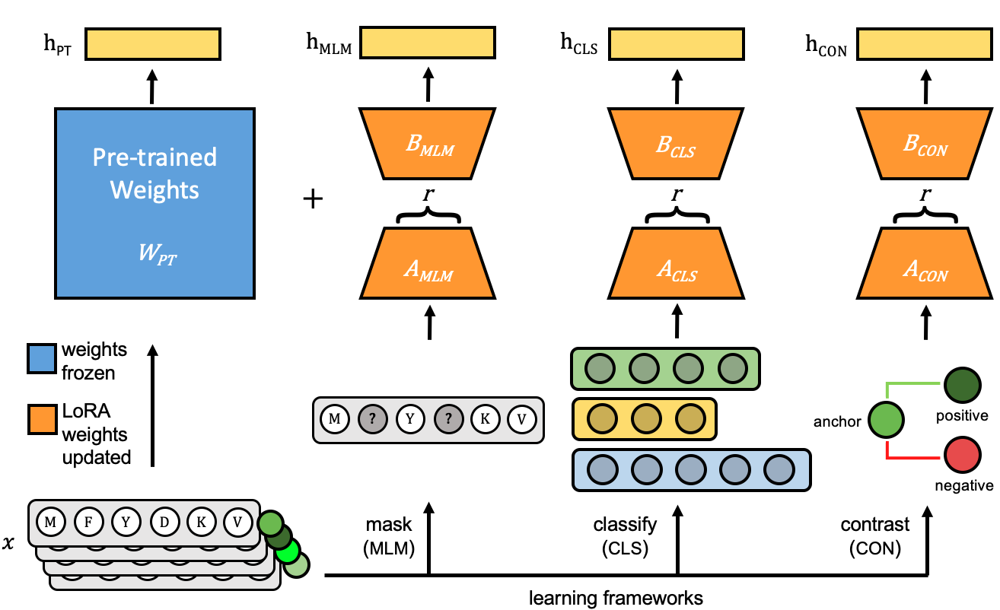

# Fine-Tuning Protein Language Models
[](LICENSE)

This repository contains PyTorch implementations of fine-tuned protein language models and related scripts for the paper ***Fine-Tuning Protein Language Models Unlocks the Potential of Underrepresented Viral Proteomes*** by Rajan Sawhney, Barbra Ferrell, Thibaut Dejean, Zachary Schreiber,
William Harrigan, Shawn W. Polson, K. Eric Wommack, and Mahdi Belcaid

[Preprint on bioRxiv](https://www.biorxiv.org/content/10.1101/2025.04.17.649224v1)



Model weights available at:
https://huggingface.co/rsawhney/fine-tuning-plms

### Example to generate and load embeddings: 

#### Read protein sequences
```python
from Bio import SeqIO 
import esm          
import torch        
from torch.nn import CosineSimilarity
from tqdm import tqdm 
```


```python
# Specify the path to the FASTA file and the output path
fasta_file_path = "data/sample.fasta"
output_path = "tmp"

# Read sequences from the FASTA file and process them
records = list(SeqIO.parse(fasta_file_path, "fasta"))
num_records = len(records)  # number of sequences
print('Number of sequences = ', num_records)
print('Seq ids:')
print([record.id for record in records])
```

#### Load model and custom checkpoint
```python
def remap(layers):
    new_state_dict = {}
    for name, param in layers.items():
        new_name = ".".join(name.split(".")[1:])
        new_state_dict[new_name] = param
    return new_state_dict
    
def get_model_and_tokenizer(weight_path, device='cpu', model_type=esm.pretrained.esm2_t36_3B_UR50D):
    model, alphabet = model_type()
    tokenizer = alphabet.get_batch_converter()
    state_dict = remap(torch.load(weight_path, map_location=device))
    model.load_state_dict(state_dict)
    return model, tokenizer

def run_model(model, tokenizer, sequence, layers=None, device='cpu'):
    if layers==None:
        layers = [model.num_layers] # last layer

    model.eval()
    with torch.no_grad():
        try:
            _, _, tokenized_inputs = tokenizer([sequence])
        except Exception as e:
            print(e)
            raise e
        tokenized_inputs = tokenized_inputs.to(device)
        model = model.to(device)
        output = {}
        output["mean_representations"] = {}
        output["representations"] = model(tokenized_inputs, repr_layers=layers)["representations"]
        # remove padding bos, eos
        for layer in layers:
            output["representations"][layer] = output["representations"][layer][:,1:-1,:] 
            output["mean_representations"][layer] = torch.mean(output["representations"][layer], dim=1)[0]
    return output

custom_chkpt="esm_ft_con.pt"

print('Loading model...')
model, tokenizer = get_model_and_tokenizer(custom_chkpt, device='cpu')
print('Model loaded')
```


#### Generate embeddings
```python
layers = [36]

# Generate and save the embeddings for each sequence
for record in tqdm(records, total=num_records, desc="Processing sequences"):
    seq_id = record.id
    sequence = str(record.seq)
    # NOTE: embeddings have a start and end padding token
    embedding = run_model(model, tokenizer, (seq_id, sequence), device='cpu')
    assert(len(sequence) == embedding["representations"][layers[0]].size()[1])
    # Save the embedding
    torch.save(embedding, f"{output_path}/{seq_id}.pt")

print('Done. Embeddings saved at:', output_path)
```

----

#### Load Embeddings

```python
seq_id1 = 'YP_009794187.1'
seq_id2 = 'YP_009293175.1'

emb1 = torch.load(f'tmp/{seq_id1}.pt')
emb2 = torch.load(f'tmp/{seq_id2}.pt')

print(emb1)

'''
Output:
{'mean_representations': {36: tensor([-0.0855,  0.2029, -0.0287,  ...,  0.0283,  0.0817, -0.0180])},
 'representations': {36: tensor([[[-0.1049, -0.2631, -0.1200,  ...,  0.2192, -0.0154, -0.0291],
           [-0.1219, -0.1293, -0.0518,  ...,  0.0723,  0.0457,  0.0058],
           [ 0.1439,  0.0029, -0.2942,  ...,  0.1125, -0.0906, -0.0572],
           ...,
           [-0.3694,  0.4474,  0.1454,  ...,  0.1179,  0.3876,  0.1132],
           [-0.5272,  0.4415, -0.0239,  ...,  0.1473,  0.2967, -0.0220],
           [-0.3340,  0.4056, -0.2002,  ..., -0.0207,  0.4104,  0.2063]]])}}
'''

emb1_mean = emb1["mean_representations"][36]
emb2_mean = emb2["mean_representations"][36]

print(emb1_mean.size())
'''
Output: torch.Size([2560])
'''
```

#### Compute Cosine Similarity
##### using: https://pytorch.org/docs/stable/generated/torch.nn.CosineSimilarity.html
```python
cos = CosineSimilarity(dim=0, eps=1e-6)
cos(emb1_mean, emb2_mean)
'''
Output: tensor(0.9778)
'''
```
----


